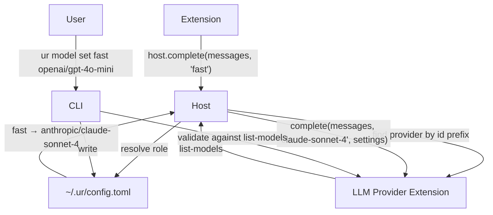

# Multi-Model Roles and Provider Capabilities

## Overview

Extensions currently call `host.complete(messages, opts)` where `opts` includes an optional model string — an unresolved, unvalidated name that couples extensions to specific providers. This plan introduces **named roles** (`default`, `fast`) that extensions request by intent, with the host resolving each role to a concrete `provider/model` pair from user configuration. Providers become **self-describing** via a new `list-models()` WIT export that declares available models and their typed settings schemas.

### Goals

1. Extensions express intent (role), not implementation (model name)
2. Users control model selection globally via `~/.ur/config.toml`
3. Providers declare their capabilities through WIT — single source of truth
4. Zero-config cold start: works out of the box with no config file
5. CLI commands for role management and settings discovery

## Proposed Solution

### Architecture



### Two Separate Interfaces

The brainstorm's key insight: there are **two `complete` signatures**, not one.

| Boundary | Caller → Callee | Signature |
|----------|-----------------|-----------|
| **Host interface** (import) | Extension → Host | `complete(messages, role)` |
| **LLM provider** (export) | Host → Provider | `complete(messages, model, settings)` |

Extensions never see models or settings. Providers never see roles.

## Technical Approach

### WIT Changes (`wit/world.wit`)

#### New Types

```wit
interface types {
    // ... existing types ...

    variant setting-schema {
        integer(setting-integer),
        enumeration(setting-enum),
        boolean(setting-boolean),
    }

    record setting-integer {
        min: s64,
        max: s64,
        default-val: s64,
    }

    record setting-enum {
        allowed: list<string>,
        default-val: string,
    }

    record setting-boolean {
        default-val: bool,
    }

    record setting-descriptor {
        key: string,
        name: string,
        description: string,
        schema: setting-schema,
    }

    record model-descriptor {
        id: string,
        name: string,
        description: string,
        is-default: bool,
        settings: list<setting-descriptor>,
    }
}
```

#### Modified `host` Interface

```wit
interface host {
    // ... existing methods ...

    // Changed: opts replaced with role string
    complete: func(messages: list<message>, role: option<string>) -> result<completion, string>;
}
```

`role: option<string>` — `None` means `"default"`. Extensions that don't care just pass `None`.

#### Modified `llm-provider` Interface

```wit
interface llm-provider {
    list-models: func() -> list<model-descriptor>;
    complete: func(
        messages: list<message>,
        model: string,
        settings: list<config-entry>,
    ) -> result<completion, string>;
}
```

#### Remove `complete-opts`

The `complete-opts` record is no longer needed. Remove it from the `types` interface.

### Config System (`src/config.rs`)

New module for loading/saving `~/.ur/config.toml`.

```rust
// src/config.rs

#[derive(Debug, Deserialize, Serialize, Default)]
pub struct UserConfig {
    #[serde(default)]
    pub roles: BTreeMap<String, String>,        // role → "provider/model"
    #[serde(default)]
    pub providers: BTreeMap<String, BTreeMap<String, BTreeMap<String, toml::Value>>>,
}
```

Config file location: `{ur_root}/config.toml` (respects `$UR_ROOT`).

Example:

```toml
[roles]
default = "anthropic/claude-sonnet-4"
fast = "openai/gpt-4o-mini"

[providers.anthropic.claude-sonnet-4]
thinking_budget = 8000
```

### Host Role Resolution (`src/extension_host.rs`)

When an extension calls `host.complete(messages, role)`:

1. Resolve `role` → `provider_id/model_id` from config (or fall back to `"default"`)
2. If role not in config, use `"default"` role mapping
3. If no config exists at all, use zero-config default (first provider's recommended model)
4. Split `"provider_id/model_id"` into provider lookup + model name
5. Look up provider-specific settings from config
6. Find the matching enabled `llm-provider` extension by extension ID prefix matching
7. Call provider's `complete(messages, model_id, settings)`

### Zero-Config Cold Start

When no `~/.ur/config.toml` exists:

1. At startup, host calls `list-models()` on each enabled llm-provider
2. Find the first model with `is_default: true` across all providers
3. Use that as the implicit `default` role mapping
4. No file is written — the implicit default is computed at runtime

### Startup Validation

At startup (or during `ur extensions check`):

1. Load config
2. For each role mapping, verify the referenced provider is enabled and the model exists in its `list-models()` output
3. If a role references a missing provider/model, warn but don't error — fall back to `default`

### CLI Commands (`src/cli.rs`)

New top-level subcommand group: `ur model`

```
ur model get <role>            # Show what a role resolves to
ur model set <role> <ref>      # Map a role to a provider/model
ur model config <role>         # Show available settings for resolved model
ur model list                  # Show all role mappings
```

#### `ur model get <role>`

Resolve and display: `default → anthropic/claude-sonnet-4`

If no config, show the zero-config default with a note.

#### `ur model set <role> <provider/model>`

1. Parse `provider/model` — must contain exactly one `/`
2. Load enabled llm-provider extensions
3. Call `list-models()` on the matching provider
4. Verify the model ID exists in the result
5. Write to config file
6. Print confirmation

#### `ur model config <role>`

1. Resolve role to provider/model
2. Call `list-models()` on the provider
3. Find the matching model descriptor
4. Print settings table:

```
Settings for anthropic/claude-sonnet-4:

  thinking_budget  integer  0..128000  (default: 4000)
```

#### `ur model list`

Display all configured roles and their resolutions:

```
ROLE       MODEL
default    anthropic/claude-sonnet-4
fast       openai/gpt-4o-mini
```

### Provider Extension Changes

Each llm-provider extension must implement the new `list-models()` method.

#### `llm-anthropic`

```rust
fn list_models() -> Vec<ModelDescriptor> {
    vec![ModelDescriptor {
        id: "claude-sonnet-4".into(),
        name: "Claude Sonnet 4".into(),
        description: "Balanced performance and cost".into(),
        is_default: true,
        settings: vec![SettingDescriptor {
            key: "thinking_budget".into(),
            name: "Thinking Budget".into(),
            description: "Token budget for extended thinking".into(),
            schema: SettingSchema::Integer(SettingInteger {
                min: 0, max: 128_000, default_val: 4_000,
            }),
        }],
    }]
}
```

#### `llm-openai`

```rust
fn list_models() -> Vec<ModelDescriptor> {
    vec![ModelDescriptor {
        id: "gpt-4o-mini".into(),
        name: "GPT-4o Mini".into(),
        description: "Fast and cost-effective".into(),
        is_default: true,
        settings: vec![SettingDescriptor {
            key: "reasoning_effort".into(),
            name: "Reasoning Effort".into(),
            description: "How much effort to spend reasoning".into(),
            schema: SettingSchema::Enumeration(SettingEnum {
                allowed: vec!["low".into(), "medium".into(), "high".into()],
                default_val: "medium".into(),
            }),
        }],
    }]
}
```

## Implementation Phases

### Phase 1: WIT Types and Provider Self-Description

Extend the WIT interface and update providers to declare their models.

- [x] Add `setting-schema` variant, `setting-integer`, `setting-enum`, `setting-boolean` records to `wit/world.wit` types interface
- [x] Add `setting-descriptor` and `model-descriptor` records to types interface
- [x] Add `list-models: func() -> list<model-descriptor>` to `llm-provider` interface
- [x] Change `llm-provider.complete` signature to `func(messages: list<message>, model: string, settings: list<config-setting>) -> result<completion, string>`
- [x] Remove `complete-opts` record from types interface
- [x] Regenerate WASM bindings (`cargo build` in each extension crate)
- [x] Implement `list-models()` in `llm-anthropic` extension with stub model descriptors
- [x] Implement `list-models()` in `llm-openai` extension with stub model descriptors
- [x] Update `complete()` in both providers to accept model + settings parameters
- [x] Update `ExtensionInstance::complete()` in `extension_host.rs` to pass model and settings
- [x] Update `ExtensionInstance` methods for calling `list_models()` on LLM instances
- [x] Verify `ur extensions check` still passes with updated providers

### Phase 2: Config System

Add user configuration loading, parsing, and persistence.

- [x] Create `src/config.rs` with `UserConfig` struct (roles map + provider settings)
- [x] Implement `UserConfig::load(ur_root)` — reads `{ur_root}/config.toml`, returns `Default` if missing
- [x] Implement `UserConfig::save(ur_root)` — writes config to `{ur_root}/config.toml`
- [x] Add `UserConfig::resolve_role(&self, role: &str) -> Option<(&str, &str)>` — returns `(provider_id, model_id)`
- [x] Add `UserConfig::settings_for(&self, provider: &str, model: &str) -> Vec<ConfigSetting>` — returns typed settings
- [x] Add `config` module to `src/main.rs`
- [x] Add `toml` serialization support (already a dependency, verify `Serialize` derive works)

### Phase 3: Host Role Resolution

Wire role resolution into the host's `complete()` dispatch.

- [x] Change `host.complete` WIT signature: replace `opts: option<complete-opts>` with `role: option<string>`
- [x] Update `HostState` to hold `UserConfig` and a map of loaded provider model lists
- [x] Update host trait impl for `complete()` to resolve role → provider/model via config
- [x] Implement zero-config fallback: if no config, call `list-models()` on enabled providers at startup, pick first `is_default: true` model
- [x] Implement role fallback: unknown roles resolve to `default`
- [x] Look up provider-specific settings from config
- [x] Route to correct provider's `complete()` with resolved model + settings
- [x] Add startup validation: warn on dangling role references (provider not enabled or model not in `list-models()`)
- [x] Update `check_extensions()` in `main.rs` to also validate role mappings

### Phase 4: CLI Commands

Add `ur model` subcommand group.

- [x] Add `Model` variant to CLI command enum with subcommands: `Get`, `Set`, `Config`, `List`
- [x] Implement `ur model list` — load config, display role table (handle zero-config case)
- [x] Implement `ur model get <role>` — resolve and display single role mapping
- [x] Implement `ur model set <role> <provider/model>` — validate against `list-models()`, write config
- [x] Implement `ur model config <role>` — resolve role, call `list-models()`, display settings table
- [x] Add `model` command routing in `main.rs`
- [x] Ensure all model commands load the wasmtime engine and relevant provider extensions for validation

## Acceptance Criteria

- [x] Extensions call `host.complete(messages, Some("fast"))` and receive completions from the role-mapped provider
- [x] Extensions call `host.complete(messages, None)` and the `default` role is used
- [x] Unknown roles fall back to `default` without errors
- [x] `ur model set default anthropic/claude-sonnet-4` validates the model exists via `list-models()` and persists to `~/.ur/config.toml`
- [x] `ur model set default fake/nonexistent` is rejected with an error
- [x] `ur model get default` displays the resolved provider/model pair
- [x] `ur model config default` displays available settings with types and defaults
- [x] `ur model list` displays all configured role mappings
- [x] With no `~/.ur/config.toml`, the system starts and uses the first available provider's default model
- [x] Startup warns about dangling roles (references to disabled providers or unknown models)
- [x] Provider-specific settings from config are passed through to the provider's `complete()` call
- [x] `ur extensions check` validates both extension health and role configuration

## Dependencies & Risks

**Dependencies:**
- Phases 1-3 of existing plans (basic extension loading, conflict management, slot-typed contracts) must be complete — WIT worlds, extension loading, and slot routing are prerequisites
- `wasmtime` bindgen must correctly handle WIT variant types for `setting-schema`

**Risks:**
- **WIT variant complexity** — The `setting-schema` variant type adds complexity to the WIT interface. If wasmtime's component model support for variants has edge cases, this could block. Mitigation: test variant round-tripping early in Phase 1.
- **Provider instantiation cost** — `list-models()` requires loading the WASM module. For CLI commands like `ur model set`, this means instantiating the provider just for validation. Mitigation: acceptable for now — providers are small and load fast. Cache if it becomes a problem.
- **Config file races** — Multiple `ur model set` calls could race on `config.toml`. Mitigation: not a concern for single-user CLI tool. Revisit if ur becomes a daemon.

## References & Context

- Brainstorm: [2026-03-21-multi-model-roles-brainstorm.md](.agents/brainstorms/2026-03-21-multi-model-roles-brainstorm.md)
- Current WIT interface: [wit/world.wit](wit/world.wit)
- Host implementation: [src/extension_host.rs](src/extension_host.rs)
- Slot definitions: [src/slot.rs](src/slot.rs)
- CLI structure: [src/cli.rs](src/cli.rs)
- Slot-typed contracts plan: [2026-03-21-feat-slot-typed-extension-contracts-plan.md](.agents/plans/2026-03-21-feat-slot-typed-extension-contracts-plan.md)
