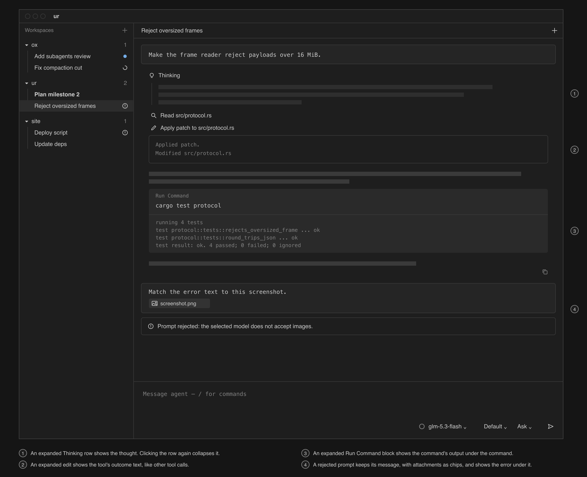
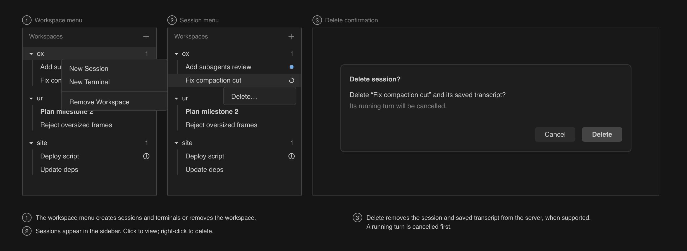
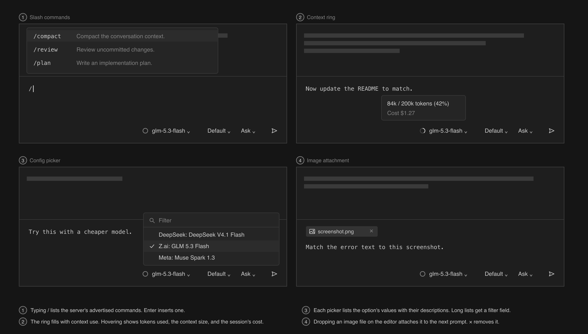
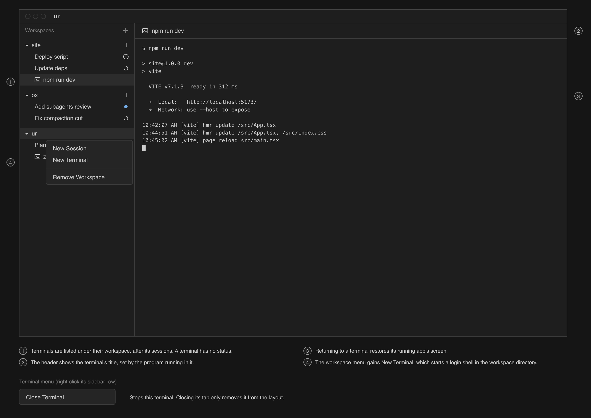
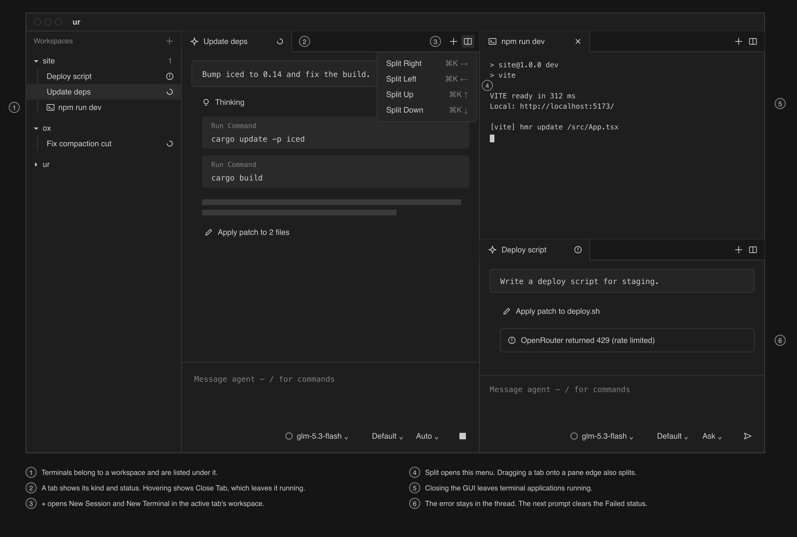

# TODO

- [x] Working terminal: a login shell in xterm.js that survives GUI disconnects.
- [x] One-shot ACP client: `ur agent-run` runs one prompt against the server.
- [x] Daemon hosts ACP sessions: the daemon runs sessions and streams their transcripts.
- [x] Status, permissions, and workspaces: workspaces, session status, and permission requests, from
      the CLI.
  - [x] [OX-0001](issues.csv:2): Prompting a session leaves its unread flag set
- [x] Restore agent history: sessions survive daemon and server restarts.
- [x] Agent GUI: a sidebar of sessions and a thread view to prompt them.
- [ ] Attention in the GUI: session status in the sidebar and permission requests in the thread.
- [ ] Thread rendering: Markdown, thinking, and tool calls as in the wireframes.
- [ ] Session management and editor: workspaces, sessions, slash commands, config options, and
      images in the GUI.
- [ ] Workspace terminal controls: terminals listed and managed under their workspace.
- [ ] Pane grid: agent sessions and terminals side by side in tabs and panes.
- [ ] Notifications and hooks: macOS notifications and an `on_event` command.

Each item has a section below with its details and a check you can run. The early agent GUI and
empty-state wireframes show Agent GUI. The other wireframes include controls from later items; each
check covers the parts its item adds. Within a section, do the work in the order listed. Each part
should leave a working slice that can be reviewed before the next one begins.

## Working terminal

Build the daemon and Tauri app in the project layout in `architecture.md`, starting with a login
shell through `portable-pty` and an xterm.js view. Restore terminal state across GUI disconnects
using `vt100::Parser` and `Screen::state_formatted()` as described under Terminals in the daemon in
`architecture.md`. This is the first working part of ur. Keep it and build the remaining items on
top of it.

- Set up the Cargo workspace, daemon socket, Tauri app, and `ur-client` framing needed for one
  terminal. Open a login shell through `portable-pty`; show its output in xterm.js and send input
  and resize events back to it.
- Feed PTY output through `vt100::Parser` and establish the terminal attachment format: a formatted
  screen snapshot followed by live output. Verify it with a running full-screen TUI while the GUI is
  attached.
- Keep the shell and parser alive across GUI disconnects. Reattach and resize the same terminal
  without losing the running application or its screen.
- Add an end-to-end suite that drives the built app, with the webview, core, and daemon working
  together, so checks no longer depend on running the GUI by hand. Run it at the end of each
  top-level item. Keep it to a short list of guarantees, recorded in `testing.md`, that hold across
  the whole app and cannot be tested in the Rust test suite. Start with this item's check: a
  full-screen application and an editor's unsaved buffer survive closing and reopening the GUI at a
  different window size.

Check with `top` and an editor holding an unsaved buffer. Close and reopen the GUI while the daemon
stays running, including at a different window size. The application must keep running, render
correctly, and accept input; the editor must retain its unsaved buffer. Get this working before
building on it.

## One-shot ACP client

`ur agent-run <workspace> <prompt>` starts the configured server, sends `initialize`, `session/new`,
and `session/prompt`, prints every update as one line, and asks on stdin when the server requests
permission. Retain the negotiated capabilities for optional features.

Check with Ox: in Ask mode, a prompt that runs `ls` stops at a permission request. Approving it
prints the tool call and the answer, and the command ends with `end_turn`.

## Daemon hosts ACP sessions

- Extend the Tokio daemon from Working terminal with the configured ACP child and one connection.
  Create sessions, send prompts, and retain user prompts and ACP updates in memory. Reject
  permission requests until Status, permissions, and workspaces.
- Add the `subscribe` request and the per-session operation guard. A subscriber receives a
  transcript snapshot followed by live updates in order; an overlapping prompt returns busy without
  changing the running turn.
- Add `ur new <path>`, `ur prompt <session> <text>`, and `ur read <session> [--follow]` over the
  socket.
- Test the session and subscription path with an SDK `Agent.builder()` fake agent in the test
  process, without a model provider. Cover snapshot then live with no gaps or duplicates and
  overlapping prompts. Use labels, permission options, and tool inputs different from Ox; include a
  minimal agent with no optional history or image capabilities. Also build the fake server, a server
  built with `Agent.builder()` that the daemon launches from the config file in end-to-end tests,
  sharing its scripted behavior with the test agent. Add the config file to `TestEnvironment` in
  `app/e2e/harness.ts`.

Check: run `ur read --follow` on a session in one terminal and `ur prompt` with a prompt that needs
no shell command in another. The reply streams into the first terminal, and a second
`ur read --follow` started partway through shows the whole transcript once.

## Status, permissions, and workspaces

- Add workspaces and their state file. `ur new` now takes a workspace name; `watch` lists sessions
  created during the current ACP connection under their workspace. Add
  `ur workspace add <name> <path>` and `ur ls`. Discovery of saved sessions through `session/list`
  belongs to Restore agent history.
- Add the session status table, `focus`, and unread tracking. Publish status and attention changes
  to all watching clients.
- Keep every pending permission request and send it to every client. Implement first-answer-wins
  responses and cancellation that answers all pending requests with `Cancelled`. Add
  `ur cancel <session>` and `ur approve|deny <session>`. Add `ur workspace rm <name>`, cancelling
  its running turns before removal.
- Add transcript entries for rejected prompts and turn errors, with the status transitions specified
  under Session status in `architecture.md`.
- Add `ur wait <session> [--until attention|idle]`. Test status transitions, first answer wins,
  several pending requests, cancellation, unread and focus, rejected prompts, turn errors, and a
  busy second prompt that leaves the first running.

Check: start two sessions in two workspaces from the CLI, run `ur wait --until attention` on both,
and approve one from a second terminal.

## Restore agent history

- On daemon startup, read the workspaces from the state file and start the configured server. When
  `session/list` is supported, follow its pagination for each workspace and add saved sessions to
  `watch` with their titles and last activity. Saved sessions start idle. Without list support, show
  only sessions created during the current ACP connection.
- Load a saved session when it is first viewed or prompted, if `session/load` is supported. Replace
  its in-memory transcript with the replayed entries and publish a fresh session snapshot. A failed
  load sets `Failed` but keeps the session in the sidebar; retry before its next prompt.
- Handle server exit during a turn: append one turn error, clear pending permissions, and restart
  the server. Reload subscribed sessions where supported and leave other saved sessions for lazy
  load. Preserve the interruption error when replacing an affected transcript. Without history
  capabilities, start new sessions after the server restarts.

Check with Ox: kill the daemon partway through a turn and start it again. The session shows its
history up to the last batch that was committed, and a new prompt works. Then kill the server
partway through a turn: the session shows the error and needs attention, and a new prompt works.

## Agent GUI

One window laid out like Zed's agent panel: a title bar, a sidebar on the left, and the selected
session or terminal. Add agent threads to the existing GUI. The GUI talks to the daemon only through
the wire protocol from Daemon hosts ACP sessions and Status, permissions, and workspaces, bridged by
the core as described under GUI architecture in `architecture.md`.

Basic agent GUI:

- Connect the Tauri core to the daemon socket, retrying until it is up. Bridge `watch`, `subscribe`,
  `prompt`, and `cancel` through the `request` command and events. Install webview listeners before
  requesting snapshots.
- Build the sidebar from `watch`, in workspace creation order and session last-activity order.
  Selecting a session subscribes to it and displays its thread. Show the no-connection,
  no-workspace, and no-selection empty states.
- Add the transcript reducer and thread view: user messages in a box with the buffer font, plain
  agent messages and thoughts, and one titled line per tool call. Add the borderless editor with
  Send and Stop.
- Save and restore the selected session. On daemon reconnect, restore watch and subscriptions, then
  replace local thread state from fresh snapshots so replay does not duplicate entries.

Empty states, before GUI workspace controls are added:

Check: add a workspace and create a session from the CLI, then prompt it and read the reply in the
GUI. Close the GUI and reopen it: the same session is selected with the same transcript. Restart the
daemon with the GUI open: it reconnects and replaces its thread state without duplicate entries, and
sending a new prompt works.

## Attention in the GUI

- Sidebar: workspaces with sessions that need attention come first, each with a count of those
  sessions. Each session shows its status at the right edge of its row: a dot when it needs
  permission, a spinner while it works, and `!` when it failed. Unread sessions are bold.
- The GUI reports focus as described under GUI architecture in `architecture.md`.
- When a session needs permission, each pending request renders from the request's tool call
  details, merged with any existing tool call of the same ID: its supplied title and content, and
  one row per permission option, with its supplied label, an icon from its kind, and a shortcut,
  followed by "Awaiting Confirmation." If no tool row exists yet, render the request after the last
  entry. No subagent detection or ID parsing. Shortcuts answer the oldest request.
- A failed turn ends with its error in the thread. A rejected prompt shows that error directly
  beneath the user message.

Check: the scenario at the top of `architecture.md`, with the sessions created from the CLI and
everything else done in the GUI.

## Thread rendering

- Agent messages render as Markdown with `react-markdown` and `remark-gfm`, with a copy button under
  each response that copies its Markdown source.
- Thoughts are a collapsed "Thinking" row. Tool calls of ACP kind `execute` use a filled "Run
  Command" block with the supplied title. Other tool calls use an icon for the kind and the supplied
  title. `raw_input` is arbitrary JSON, not a portable command schema; ur does not depend on a
  `command` key or recognize server-specific tool names.
- Clicking a Thinking row or a tool call expands its content: the thought's text or the tool call's
  text content. Edits show their outcome text like other tool calls. A Run Command block expands to
  its output.
- A rejected prompt shows its error under the user message.

Tool presentation follows ACP's
[tool call fields](https://agentclientprotocol.com/protocol/v1/tool-calls), not the server's tool
implementation.

Check: use a session with thinking, edits, and shell commands, then send a prompt the server
rejects. Each renders as in the wireframes, and the thinking and tool rows expand and collapse.

## Session management and editor

- Add workspace controls: `+` opens the dialog plugin's folder picker and adds a workspace named
  after the folder. A native workspace context menu offers New Session and Remove Workspace, with
  the required confirmation. Add the session title above the thread and `+` to create a session in
  that workspace.
- Implement `delete_session` through the daemon and GUI when the server advertises it. Add Delete to
  the session's native context menu. Confirm, then cancel any active turn, wait for it to end, and
  call `session/delete` as described under Sessions, tabs, and workspaces in `architecture.md`.
- Pass through `available_commands_update`, config options, and usage data. Show slash commands when
  the user types `/`, add one picker for each supplied config option with `set_config_option`, and
  show usage indicators when reported, with available tokens and cost on hover.
- When image prompts are supported, accept image content through the prompt path. Use the window's
  drag-drop event to attach an image file to the next prompt; the core reads the file. Route server
  rejection through the ordinary prompt-error path without hard-coding Ox's image limits.

Check: the scenario at the top of `architecture.md`, done entirely in the GUI.

## Workspace terminal controls

Extend the existing terminal implementation with workspace ownership and sidebar controls. Carry the
terminal title in `watch`; use the shell's name until a program sets a title. Terminals are listed
under their workspace in the sidebar. The workspace menu gains New Terminal, which starts a login
shell in the workspace directory. Selecting it shows the xterm.js pane under a header with its
title. Right-clicking a terminal in the sidebar offers Close Terminal, which stops it.

Check: create terminals in two workspaces. Leave `npm run dev` running while closing and reopening
the GUI. Selecting its terminal restores the view; Close Terminal stops it.

## Pane grid

The session area becomes a dockview layout that holds agent sessions and terminals side by side.
Each dockview group is a pane, and each panel is a tab.

A tab is a custom tab component that shows its kind (agent or terminal) and, for an agent, its
status; hovering a tab shows its Close Tab button, which leaves its session or terminal running. The
group's header actions hold `+`, which opens New Session and New Terminal in the active tab's
workspace (or the selected sidebar workspace if the pane is empty), and the split button, which
opens Split Right, Left, Up, and Down, each with a shortcut. Dragging a tab is dockview's own:
dropping it on a pane's edge splits, and dropping it on a pane's center moves the tab there.
Choosing a session or terminal in the sidebar opens it in the active pane; a terminal with an
existing tab activates that tab. The GUI focuses every session visible in a pane and saves the
layout as described under GUI state in `architecture.md`.

- Replace the single session area with dockview groups and panels for agent sessions and terminals.
  Add custom tabs with kind, agent status, and Close Tab; closing a tab leaves its session or
  terminal running.
- Add group header actions for New Session, New Terminal, and splits in four directions with
  shortcuts. Use dockview's tab dragging to split or move tabs between panes.
- Open a sidebar selection in the active pane; activate an existing terminal tab instead of opening
  a duplicate. Report focus for every visible session and save and restore the dockview layout,
  dropping references to sessions or terminals that no longer exist.

Check: a terminal running `npm run dev` next to an agent session. Close the GUI, reopen it, and both
are restored in the same layout.

## Notifications and hooks

- The daemon posts a macOS notification when a session starts to need attention and no client has it
  focused, so notifications arrive while the GUI is closed.
- `on_event` in `$XDG_CONFIG_HOME/ur/config.toml` (under `~/.config` when the variable is unset): a
  command the daemon runs for each status change, with the event as JSON on stdin.

Check: start a long prompt, switch to another app, and get a notification when it finishes.
