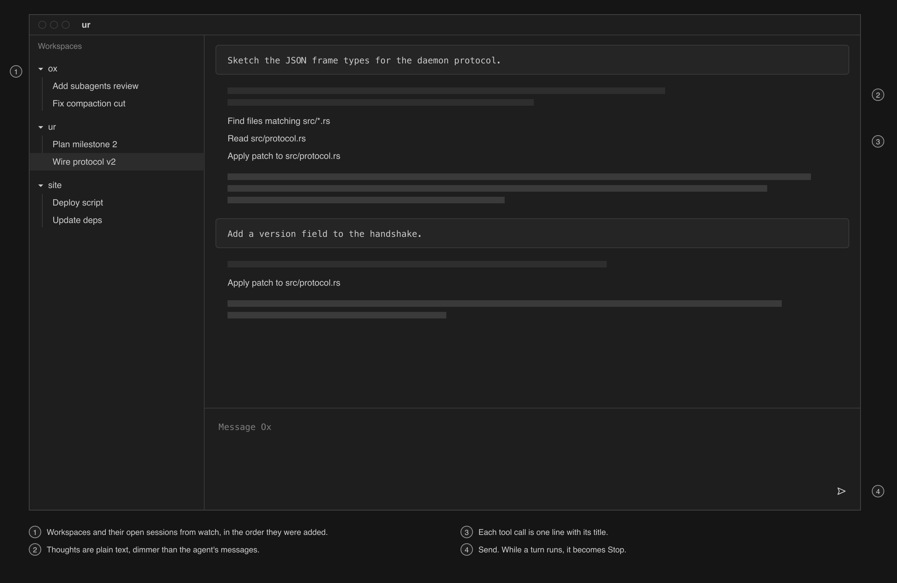
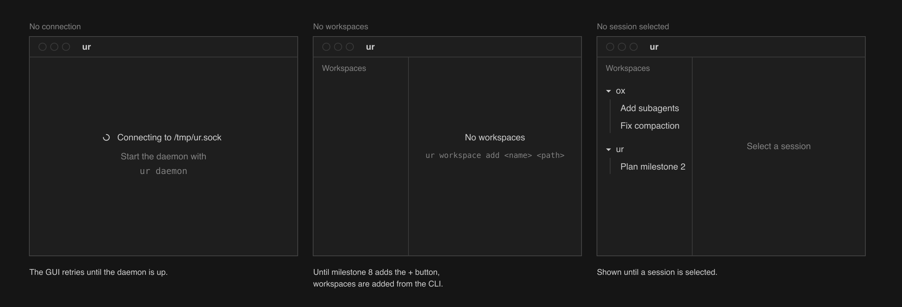
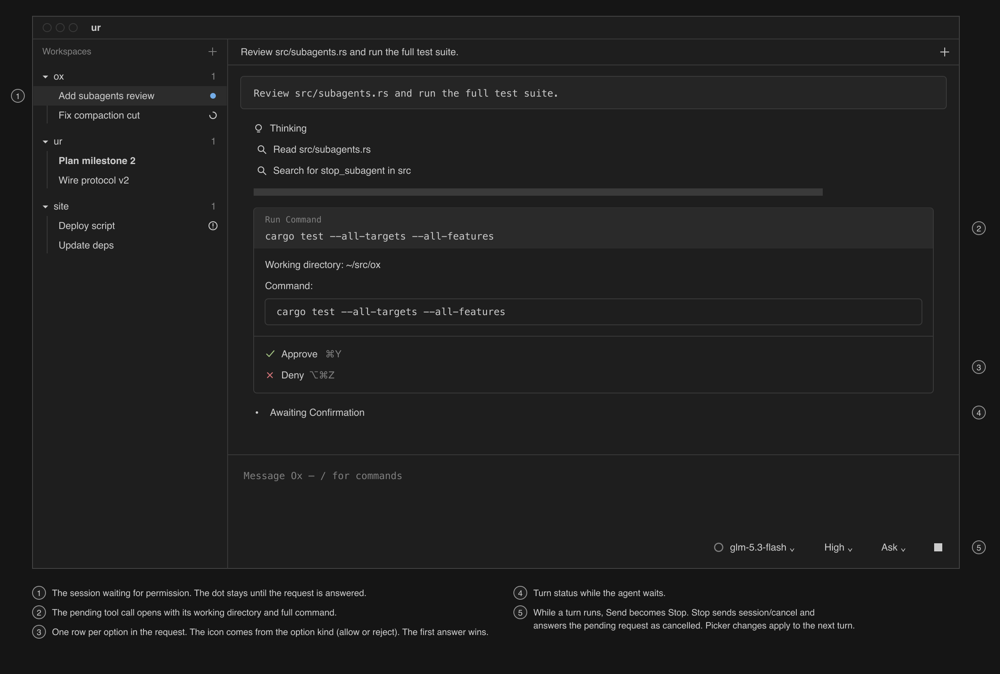
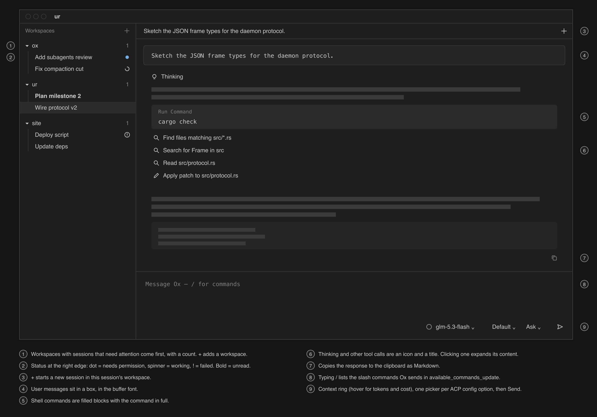
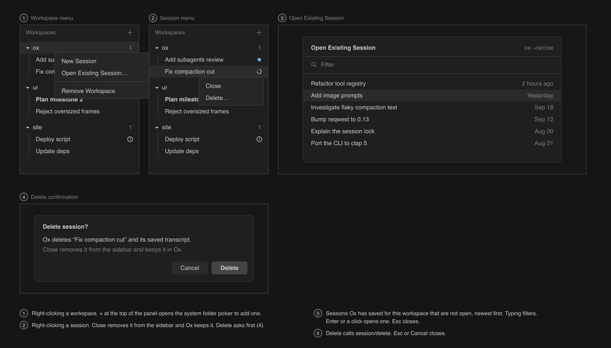
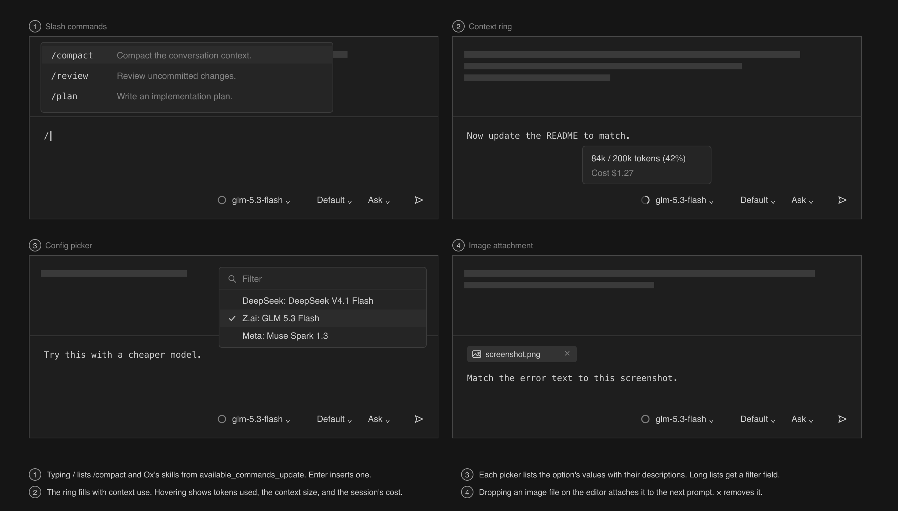

# ur plan

This breaks ur into a sequence of milestones. The agent is Ox (`~/src/ox`),
and ur is the ACP client for it. When all milestones are done, you
can run ten Ox sessions across three repositories, close the window, come back
later, see which sessions need attention, and approve, answer, or cancel them
from the GUI or the command line.

## What Ox provides

These facts about Ox shape the design. They were checked against Ox's source
(`src/acp.rs`, `src/acp/convert.rs`, `src/acp/prompt.rs`) and
`eng/architecture.md`.

- One `ox` process serves one ACP connection that holds many sessions. Each
  session allows only one prompt, load, or delete at a time, and different
  sessions run at the same time. A delete requested while a prompt runs is
  rejected.
- Ox saves every transcript in its own SQLite database. It advertises
  `loadSession`, `session/list`, `session/delete`, and image prompts.
  `session/load` replays the saved transcript as `session/update`
  notifications and ends with a `usage_update`; it sends no
  `session_info_update`. `session/list` returns each session's title and last
  activity and filters by workspace path. Both `session/load` and
  `session/list` match the workspace path byte for byte.
- Ox does not send the user's prompt back as a live `user_message_chunk`. The
  user message appears only when a session is replayed. When a turn starts, Ox
  sends a `session_info_update` with the time of the last activity, and on the
  session's first turn also its title, taken from that prompt.
- Model, effort, and mode are ACP config options (`session/set_config_option`).
  There are two modes, and a new session starts in Ask. In Ask mode, Ox asks
  permission before it starts a shell command or writes input to one. In Auto
  mode it never asks. A permission request offers two choices, `approve`
  (`allow_once`) and `deny` (`reject_once`). Its tool call carries the working
  directory and the full command in its text content.
- Ox announces every tool call in a batch as a pending `tool_call` before it
  asks permission for any of them, so the main agent's permission request
  always refers to a tool call the client has already seen.
- Ox runs up to four subagents at once inside a main session's turn. Their
  updates are not sent. Their permission requests arrive on the main session,
  with the tool call ID scoped as `<subagent>:<call>` and the title prefixed
  `Subagent <id>:`, so one session can have several requests pending at once.
  A subagent's final answer appears in the main session as a finished tool
  call of kind `other`.
- A tool call carries its arguments as `raw_input` and its outcome text as
  content. Shell calls are kind `execute`, with the full command in
  `raw_input.command` and a shortened title; `shell_process` calls are also
  `execute` and have no command. Edits are kind `edit`, with the patch in
  `raw_input.patch` in Ox's patch format; there is no diff content and no
  locations. File reads are `read`; glob and grep are `search`.
- Ox reports cost and context use in `usage_update` after each assistant batch
  it commits. Ox has its own tools and asks the client for no `fs/*` or
  `terminal/*` methods.
- When the connection closes, Ox cancels the prompts that are running and kills
  their shell processes. Whatever was committed before that point stays saved.
  Ox exits when its stdin closes.
- Ox reads credentials from the environment or the OS keyring on the first
  `session/new`, `session/load`, or `session/prompt`, and picks up a key saved
  by `ox auth login` on the next request. Without a key, those requests fail
  with `auth_required`.
- A prompt accepts up to four images and 10 MiB of decoded image data in
  total.

## Decisions

### One Ox process per daemon

The daemon starts one `ox` child and keeps one ACP connection to it. Every
session in every workspace runs on that connection. This follows how Ox is
built: one database connection, a lock for each session, and sessions listed
across workspaces. The cost is that if Ox crashes, every session stops. The
daemon handles that by starting Ox again and restoring the sessions
(milestone 4).

### Ox is the durable store

The daemon saves no transcripts. It keeps each open session's transcript in
memory as a list of entries of three kinds: an ACP `SessionUpdate` it
received, a user prompt it sent, and a turn error. A user prompt entry records
the error when Ox rejected the prompt. After a restart, the daemon rebuilds
the list from `session/load`, which replays the transcript. Live turns and
restores go through the same code. Rejected prompts and turn errors exist only
in memory and are gone after a restart.

Titles come from `session_info_update` during a turn. At startup the daemon
calls `session/list` once and takes the title and last activity of every open
session from it. A session with no title yet shows as "New session".

The daemon's own state file (`$XDG_STATE_HOME/ur/state.json`, under
`~/.local/state` when the variable is unset) holds only:

- workspaces: name and absolute path
- open sessions: Ox session ID and workspace

A workspace path is made absolute when the workspace is added and stored as
is. Every `session/new`, `session/load`, and `session/list` call for that
workspace passes that exact string.

Ox's `session/list` has every session ever created. ur shows only open
sessions. Open Existing Session in the workspace menu reads Ox's list for the
workspace path.

### Session status

The daemon owns one status for each session. Every client reads the same value.

| Status | Enters when | Leaves when |
|---|---|---|
| `Idle { last_stop }` | the prompt returns a stop reason, or a session that was not mid-turn is opened or loaded | a prompt is sent |
| `Working` | a prompt is sent, or the last pending permission request is answered | the prompt returns, or a permission request arrives |
| `NeedsPermission { requests }` | a permission request arrives | the last pending request is answered, or the session is cancelled |
| `Failed { message }` | the prompt returns a JSON-RPC error, a load fails, or Ox exits while the session is `Working` or `NeedsPermission` | a prompt is sent |

`requests` holds every pending permission request for the session, oldest
first, because the main agent and each subagent can ask at the same time. A
prompt sent to a session whose load failed loads it first; if the load fails
again, the session returns to `Failed`.

Each session also has an `unread` flag. It turns on when a turn ends or fails
while no client has the session focused, and turns off when a client focuses
it. A session **needs attention** when it is `NeedsPermission`, `Failed`, or
unread. The sidebar sorts workspaces and sessions by this.

A client focuses the set of sessions it is showing. The GUI focuses every
session visible in a pane while its window has focus, and focuses nothing when
the window loses focus. A client's focus clears when it disconnects.

### Permissions

The daemon holds the ACP responder for each pending permission request and
sends the request to every attached client. Any client can answer, and the
first answer wins. The daemon then tells every client the request is resolved.
When a client cancels a session, the daemon sends `session/cancel` and
answers every pending permission request for that session with `Cancelled`,
which the ACP spec requires. The GUI draws one button per option in the
request, so it does not depend on Ox's two choices. The CLI's `approve` and
`deny` answer the session's oldest pending request with its first `allow_*`
or `reject_*` option.

### Closing sessions and workspaces

Close and Delete on a session that is `Working` or `NeedsPermission` cancel it
first. Delete waits for the prompt to return, then calls `session/delete`.
Remove Workspace closes the workspace's open sessions the same way and closes
its terminals, after a confirmation that says how many of each it will close.

### User messages

When the daemon sends `session/prompt`, it adds a user prompt entry to the
session's in-memory transcript. If Ox rejects the prompt with an error before
the turn starts (for example, the input is too large or the model does not
accept images), the daemon records the error on that entry and shows it.
After a restart, the user messages come back from Ox's replay.

### Turn errors

When `session/prompt` returns a JSON-RPC error, or Ox exits during a turn, the
daemon appends a turn error entry with the message and sets the session
`Failed`. The entry stays in the thread; the next prompt clears the `Failed`
status.

### Config options

The daemon passes through the `configOptions` that Ox returns from
`session/new`, `session/load`, and `session/set_config_option`, and the GUI
shows one picker for each. This covers model, effort, and Ask/Auto mode without
ur knowing anything specific about them.

### Wire protocol

The socket uses one frame format: a one-byte tag, a big-endian `u32` length,
and the payload. Tags:

- `JSON`, both directions: a serde-encoded message. From the client, a request
  with an ID. From the daemon, a response with the request's ID, or an event.
- `PTY`, both directions: a terminal ID followed by raw bytes. From the client,
  input. From the daemon, output. This keeps terminal output out of JSON.
- `PTY_REPLAY`, from the daemon: a terminal ID, the PTY's rows and columns,
  and the retained output. Sent once in reply to `attach_terminal`.

Events contain ACP schema types (`SessionUpdate`, `RequestPermissionRequest`,
`SessionConfigOption`) unchanged, so the GUI renders ACP directly with no
translation layer. Client requests:

```text
watch
add_workspace | remove_workspace | list_saved_sessions(workspace)
new_session | open_session | close_session | delete_session
subscribe(session) | unsubscribe(session) | focus(sessions)
prompt(session, content) | cancel(session)
answer_permission(session, request_id, option_id)
set_config_option(session, option_id, value)
open_terminal(workspace) | attach_terminal | detach_terminal
terminal_input | terminal_resize | close_terminal
```

There are three levels of events. `watch` covers the sidebar: workspaces,
their open sessions and terminals, each session's title, status, and unread
flag, and each terminal's title. `subscribe` covers one session's content: its
transcript, config options, and pending permission requests. `attach_terminal`
covers one terminal: its replay frame, then live output. All three work the
same way: under one lock, the daemon sends a snapshot and registers the client
for live events, so the client sees every change exactly once. A client that
cannot keep up is dropped.

`list_saved_sessions` returns Ox's `session/list` for the workspace path, minus
the sessions already open.

### Project layout

One Cargo workspace:

- `crates/ur`: the `ur` binary, which is the daemon and the CLI.
- `crates/ur-client`: the frame format, the request and event types, and an
  async client for the socket. The CLI and the GUI both use it.
- `app/`: the Tauri 2 app. `app/src` is the frontend, React and TypeScript
  built with Vite. `app/src-tauri` is the app's Rust core, a workspace member
  that depends on `ur-client`. `pnpm tauri dev` runs it against a daemon that
  is already running.

### GUI architecture

The GUI is a Tauri app. Its Rust core is the socket client: it connects to
the daemon, retries until the daemon is up, and is the only part of the app
that speaks the wire protocol. The webview never touches the socket.

- Each client request in the wire protocol is a Tauri command with the same
  name and arguments. The core sends it to the daemon and returns the
  daemon's response.
- Daemon events reach the webview as Tauri events: `watch` events under one
  name, and each subscribed session's events under a name that carries the
  session ID. The webview keeps the sidebar and each open session's
  transcript as React state built from those events.
- Terminal output goes through a Tauri IPC `Channel` of raw bytes, one per
  attached terminal, so it is never JSON-encoded. Terminal input goes to the
  core as the string that xterm.js emits.
- The webview tells the core which sessions are visible in panes. The core
  combines that with the window's focus, which it gets from
  `WindowEvent::Focused`, and sends `focus` to the daemon as described under
  Session status.
- Native pieces come from Tauri: the dialog plugin for the folder picker,
  `Menu::popup` for context menus, and the window's drag-drop event, which
  gives the core file paths to read and attach to the next prompt. Keyboard
  shortcuts are handled in the webview.
- The core writes the GUI state file described below.

### Terminals in the webview

A terminal pane is an xterm.js `Terminal` with the fit addon. When the pane
attaches, the core forwards the replay frame: the webview creates the terminal
at the PTY's rows and columns, writes the retained output, and then fits the
terminal to the pane, which sends `terminal_resize` and lets xterm.js reflow
the buffer. Input from `onData` is ignored until the replay write's callback
runs, because the replay can contain terminal queries that another client
already answered. After that, `onData` goes to `terminal_input` and
`onResize` to `terminal_resize`. Live `PTY` frames are written to the
terminal as they arrive.

### GUI state

The core keeps the GUI's layout in `$XDG_STATE_HOME/ur/gui.json`, keyed by
socket path: the selected session or terminal, and from milestone 10 the pane
layout as dockview's serialized layout. Panes refer to sessions and terminals
by ID. When the GUI opens, it drops panes whose session or terminal no longer
exists.

### Transport

The daemon listens on a Unix socket, `$UR_SOCKET` or `$TMPDIR/ur.sock`. There
is no TCP listener and no auth code.

### Runtime

The daemon runs on Tokio, because the ACP Rust SDK (`agent-client-protocol`
2.1.0, the version Ox uses) is async. It uses `Client.builder()` with handlers
for `SessionNotification` and `RequestPermissionRequest`, and `connect_with`
to an `AcpAgent` built from the Ox command (see the SDK's
`examples/yolo_one_shot_client.rs`). PTY reads stay on a blocking thread. The
app's core runs the socket connection on Tauri's Tokio runtime.

## Milestones

Each milestone ends with a check you can run. Milestone 0 proves the terminal
path, 1–4 build the daemon and CLI, 5–8 build the GUI for agent sessions, 9–10
add terminals and panes, and 11 adds notifications and hooks. The wireframes
show the finished GUI; each check covers the parts its milestone adds.

### 0. PTY spike

The project layout above, with a daemon that owns a login shell in a PTY and a
Tauri window that renders it with xterm.js. The daemon spawns the shell with
`portable-pty`, keeps the last 1 MiB of output, and serves clients over the
socket with the `PTY` and `PTY_REPLAY` frames. The window attaches as
described under Terminals in the webview. Input and resizes from any client go
to the PTY, and several windows can attach at once.

Check: run `top` in the window, close the window, and open it again. The
screen is restored and `top` keeps updating. Resize the window and the screen
reflows.

### 1. One-shot ACP client against Ox

`ur ox-run <workspace> <prompt>` starts `ox`, sends `initialize`,
`session/new`, and `session/prompt`, prints every update as one line, and asks
on stdin when Ox requests permission.

Check: in Ask mode, a prompt that runs `ls` stops at a permission request.
Approving it prints the tool call and the answer, and the command ends with
`end_turn`.

### 2. Daemon hosts Ox sessions

- Tokio daemon with the Ox child, in-memory transcripts, and the JSON protocol
  with `subscribe`. The spike's PTY serving leaves the daemon here and returns
  as terminal panes in milestone 9.
- CLI commands over the socket: `ur new <path>`, `ur prompt <session> <text>`,
  and `ur read <session> [--follow]`.
- The daemon rejects every permission request until milestone 3.
- Tests use a fake agent built with the SDK's `Agent.builder()` in the test
  process, so they run without OpenRouter. This milestone covers snapshot then
  live with no gaps or duplicates.

Check: run `ur read --follow` on a session in one terminal and `ur prompt` with
a prompt that needs no shell command in another. The reply streams into the
first terminal, and a second `ur read --follow` started partway through shows
the whole transcript once.

### 3. Status, permissions, and workspaces

- The status table, the unread flag, `focus`, and `watch`.
- Permission requests go to every client. First answer wins, and cancel
  answers every pending request with `Cancelled`.
- Rejected prompts and turn errors are entries in the transcript.
- Workspaces and the state file. `ur new` takes a workspace name.
- CLI commands: `ur workspace add <name> <path>`, `ur workspace rm <name>`,
  `ur ls`, `ur cancel <session>`, `ur approve|deny <session>`, and
  `ur wait <session> [--until attention|idle]`.
- Tests cover status transitions, first answer wins, several requests pending
  on one session, cancel answering the pending permission requests, unread and
  focus, a rejected prompt, and a turn error.

Check: start two sessions in two workspaces from the CLI, run
`ur wait --until attention` on both, and approve one from a second terminal.

### 4. Restore after restart

When the daemon starts, it reads the state file, starts Ox, reads titles from
`session/list`, and calls `session/load` for every open session, which
rebuilds the transcripts from the replay. A session whose load fails is
`Failed` with the error and stays in the open list. If Ox exits, the daemon
starts Ox again and loads the sessions the same way. A session that was
mid-turn when Ox exited gets a turn error, is `Failed`, and turns unread; the
others return to `Idle`.

Check: kill the daemon partway through a turn and start it again. The session
shows its history up to the last batch that was committed, and a new prompt
works. Then kill Ox partway through a turn: the session shows the error and
needs attention, and a new prompt works.

### 5. Thin GUI

One window laid out like Zed's agent panel: a title bar, a workspace panel on
the left, and the selected session. This replaces the spike's terminal view.
The GUI talks to the daemon only through the protocol from milestones 2 and 3,
bridged by the core as described under GUI architecture.



- The core connects to the daemon socket and retries until the daemon is up.
  Commands and events for `watch`, `subscribe`, `prompt`, and `cancel`.
- Workspace panel: workspaces and their open sessions from `watch`, in the
  order they were added. Clicking a session selects it.
- Thread: user messages in a box, in the buffer font. Agent messages and
  thoughts are plain text. Each tool call is one line with its title.
- Message editor: a borderless text area and Send. While a turn runs, Send
  becomes Stop.
- Empty states for no connection, no workspaces, and no selected session.



Check: add a workspace and create a session from the CLI, then prompt it and
read the reply in the GUI. Close the GUI and reopen it: the same session is
selected with the same transcript.

### 6. Attention in the GUI

- Workspace panel: workspaces with sessions that need attention come first,
  each with a count of those sessions. Each open session shows its status at
  the right edge of its row: a dot when it needs permission, a spinner while
  it works, and `!` when it failed. Unread sessions are bold.
- The GUI reports focus as described under GUI architecture.
- When a session needs permission, each pending request renders from the
  request's own tool call: its title, its text content, which holds the
  working directory and the full command, and one row per option, with an
  icon from the option's kind and a shortcut, followed by "Awaiting
  Confirmation." The main agent's request opens the pending tool call already
  in the thread; a subagent's request has no row of its own and renders after
  the last entry. The shortcuts answer the oldest request.
- A failed turn ends with its error in the thread.



Check: the scenario at the top of this document, with the sessions created
from the CLI and everything else done in the GUI.

### 7. Thread rendering

- Agent messages render as Markdown with `react-markdown` and `remark-gfm`,
  with a copy button under each response that copies its Markdown source.
- Thoughts are a collapsed "Thinking" row. A shell call with a command in
  `raw_input` is a filled "Run Command" block showing the full command. Other
  tool calls, edits and `shell_process` calls included, are an icon for the
  kind and the title.
- Clicking a Thinking row or a tool call expands its content: the thought's
  text, a tool call's text content, or an edit's diff. ur builds the diff by
  parsing the patch in `raw_input`: one section per file with the file name,
  the counts of added and removed lines, and the changed lines with context.
  A Run Command block expands to its output, the call's text content.
- A rejected prompt shows its error under the user message.




Check: open a session whose history has thinking, edits, shell commands, and a
rejected prompt. Each renders as in the wireframes, and each expands and
collapses.

### 8. Session management and editor

- `+` in the workspace panel opens the dialog plugin's folder picker and adds
  the folder as a workspace named after it.
- Right-clicking a workspace pops up a native menu with New Session, Open
  Existing Session, and Remove Workspace. Open Existing Session lists
  `list_saved_sessions` with titles and last activity. Right-clicking a
  session offers Close, which removes it from the open list while Ox keeps
  it, and Delete, which asks for confirmation and then calls
  `session/delete`. Remove Workspace, Close, and Delete behave as described
  under Closing sessions and workspaces.
- Thread header: the session title from `session_info_update`, or "New
  session", and `+`, which starts a new session in the same workspace.
- Message editor: typing `/` lists the slash commands Ox sends in
  `available_commands_update`. Dropping an image file on the editor attaches
  it to the next prompt: the window's drag-drop event gives the path, and the
  core reads the file, within Ox's limit of four images and 10 MiB per
  prompt. Along the bottom edge are the context ring from `usage_update`
  (hover for tokens and cost), one picker for each config option, and Send.





Check: the scenario at the top of this document, done entirely in the GUI.

### 9. Terminals in the daemon

Move the PTY code from the spike into the daemon as a second kind of pane,
owned by a workspace and served through `attach_terminal` and `PTY` frames.
The daemon scans each terminal's output for the OSC 0 and OSC 2 title
sequences and carries the latest title in `watch`; until a program sets one,
the title is the shell's name. Terminals are listed under their workspace in
the sidebar, and the workspace menu gains New Terminal, which starts a login
shell in the workspace directory. Selecting a terminal shows the spike's
xterm.js pane in place of the thread, under a header with its title.
Terminals do not survive a daemon restart.


Check: start `npm run dev` in a terminal from the GUI, close the GUI, and
reopen it. The terminal is still running with its screen restored.

### 10. Pane grid

The session area becomes a dockview layout that holds agent sessions and
terminals side by side. Each dockview group is a pane, and each panel is a
tab.

A tab is a custom tab component that shows its kind (agent or terminal) and,
for an agent, its status; hovering a tab shows its close button, and closing a
tab leaves its session or terminal running. The group's header actions hold
`+`, which opens New Session and New Terminal in the pane's workspace, and the
split button, which opens Split Right, Left, Up, and Down, each with a
shortcut. Dragging a tab is dockview's own: dropping it on a pane's edge
splits, and dropping it on a pane's center moves the tab there. Choosing a
session or terminal in the sidebar opens it in the active pane. The GUI
focuses every session visible in a pane and saves the layout as described
under GUI state.


Check: a terminal running `npm run dev` next to an agent session. Close the GUI,
reopen it, and both are restored in the same layout.

### 11. Notifications and hooks

- The daemon posts a macOS notification when a session starts to need
  attention and no client has it focused, so notifications arrive while the
  GUI is closed.
- `on_event` in `$XDG_CONFIG_HOME/ur/config.toml` (under `~/.config` when the
  variable is unset): a command the daemon runs for each status change, with
  the event as JSON on stdin.

Check: start a long prompt, switch to another app, and get a notification when
it finishes.
